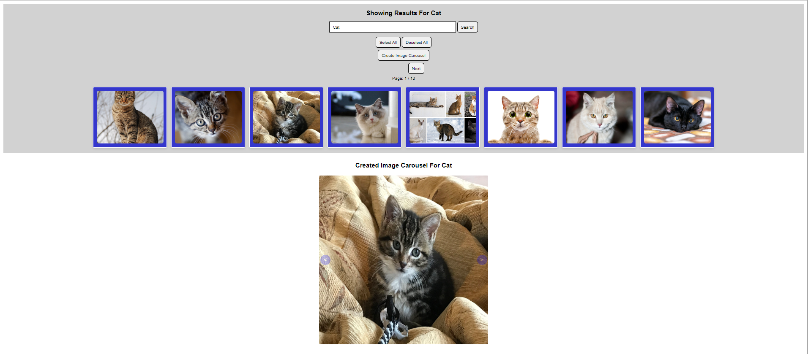

# Framework Development project - Image Search + Image Carousel Creation Web Component

## Overview



Image Search + Image Carousel Creation is a custom web component using LitElement with JavaScript. It defines a custom search bar which utilises an API based on the Google Images Search to fetch a list of images based on the searched term. These images are displayed on multiple pages (page size can be customized) and can be selected in order to create a custom image carousel (carousel width and height can be customized).

## Setup

Clone the repository and install the necesary dependencies:

```bash
npm i
```
After everything was installed I recommend an update to remove any possible problems:

```bash
npm update
```

## API KEY (Image searching)

Get your API key from https://rapidapi.com/Glavier/api/google-image-search1/ from the JavaScript - fetch code snippet and add it into a file called ./apikey.js:

In the end, the file should look like this

```js
const options = {...};
export { options };
```

## Dev Server

This web component uses modern-web.dev's [@web/dev-server](https://www.npmjs.com/package/@web/dev-server) for previewing the project without additional build steps. Web Dev Server handles resolving Node-style "bare" import specifiers, which aren't supported in browsers. It also automatically transpiles JavaScript and adds polyfills to support older browsers. See [modern-web.dev's Web Dev Server documentation](https://modern-web.dev/docs/dev-server/overview/) for more information.

To run the dev server and open the project in a new browser tab:

```bash
npm run serve
```

The site will usually be served at http://localhost:8000.

## Integration

The web component is easily integrable, you just have to import a few scripts (custom web component loader, lit and our custom web component):

```html
    <script src="node_modules/@webcomponents/webcomponentsjs/webcomponents-loader.js"></script>
    <script src="node_modules/lit/polyfill-support.js"></script>
    <script type="module" src="fd-element.js"></script>
```

Then you can use the component freely:

```html
<fd-element [carouselMaxWidthSize]="800" [carouselMaxHeightSize]="800" [imagesPerPage]="8"> </fd-element>
```

## Editing

If you use VS Code, I highly reccomend the [lit-plugin extension](https://marketplace.visualstudio.com/items?itemName=runem.lit-plugin), which enables some extremely useful features for lit-html templates:

- Syntax highlighting
- Type-checking
- Code completion
- Hover-over docs
- Jump to definition
- Linting
- Quick Fixes

The project is setup to reccomend lit-plugin to VS Code users if they don't already have it installed.


## Description

We are starting with only the search bar, where we can input our term for which we will perform the image search.


After searching for our desired term, we are prompted with a list of images, divided into multiple pages and a menu where we can change a page (previous - next page), select/deselect all images (this way we select/deselect all images, we can select a singular image by clicking it) and a create image carousel button, which appears if we have at least one image selected. Pages are displaying either the default amount of images, which is 8 images / page, or a custom amount, depending on our given input. We can navigate through the pages by pressing the Previous/Next buttons.


After selecting our desired images and pressing the Create Image Carousel another element will be generated, an image carousel from our selected images, having either the default dimensions(500x500), or a custom dimension, depending on our input. We can navigate through images by pressing the arrows situated on the image carousel(if we reach one end, either the start or the last image, we loop around: image 1 -> last image or last image -> image 1)


## Code

The code of the web component is pretty straight forward, it follows the template of any LitElement web component. We are not using any external libraries to define our components apart from what we import from LitElement: 

```js
import {LitElement, html, css} from 'lit'; // importing used Lit components
import { options } from './apikey'; // importing our image search API key

export class FdElement extends LitElement {
    static get styles(){...} // css code for all components
    constructor(){...} // initialization of all components used
    static get properties(){...} // definition of all components used + custom attributes
    render(){...} // html template for the component
    multipleJavaScriptFunctions(){...}
    }

    window.customElements.define('fd-element', FdElement); // definition of our web component
```

We have two main component divs (searchContainer and imageCarousel). For each part, we have a main function:
 
 ```js
 searchBarInputClick(){...} 
 ```
 Here we fetch the images based on the given term, for each image we create a custom element that can be selectable and we divide them into pages of varying sizes. 
 Images are loading once and they persist until a new search is done or we refresh the page. 
 We can select images from different pages, having the option to create a custom image carousel from them.

 ```js
 createImageCarousel(){...}
 ```

 Here we take the list of selected images, we set them according to our given resolution(500x500 default or a custom resolution) and we construct the carousel.

 Because we are not using any templates, only HTML, CSS and JavaScript, we are displaying only one image at a time in the carousel, without complex transitions, losing image quality in some cases because of the fixed resolution throughout the carousel.

 In case an image cannot be loaded by various reasons, we display a placeholder image set at the carousel resolution, using [placeholder.com](https://placeholder.com/) 
 Example: "https://via.placeholder.com/[width]x[height]" : [500x450 Placeholder Example](https://via.placeholder.com/500x450)  